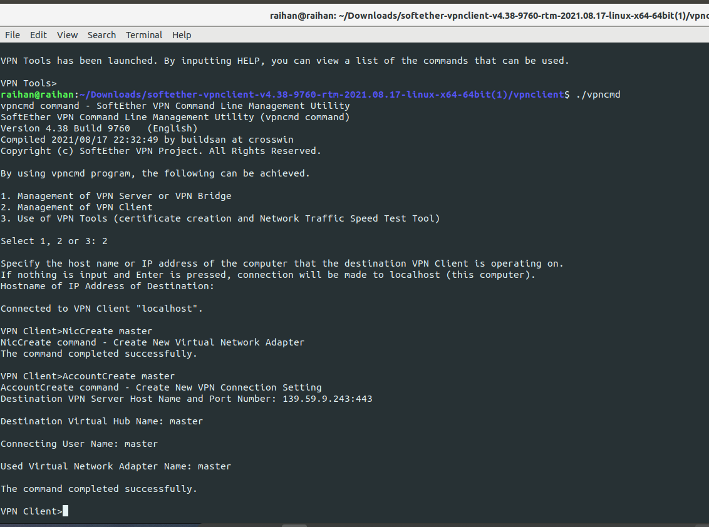
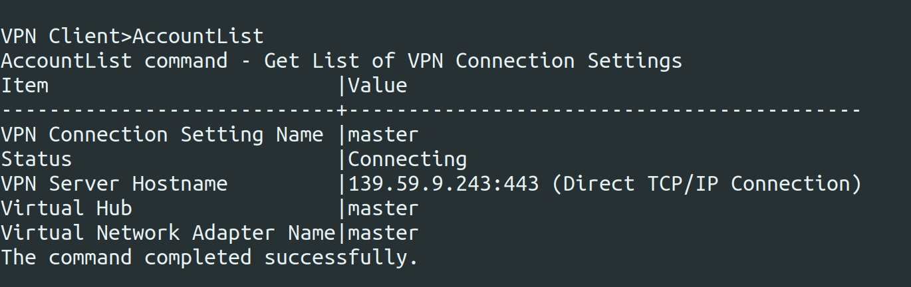

## Set up SoftEther VPN Client on Linux

> cd vpnserver

> make

> Check

> sudo ./vpnclient start

> NicCreate master

> AccountCreate master

> AccountPassword master

> AccountConnect master

> AccountList

>> FREE CLIENT SERVER > https://www.vpngate.net/en/

